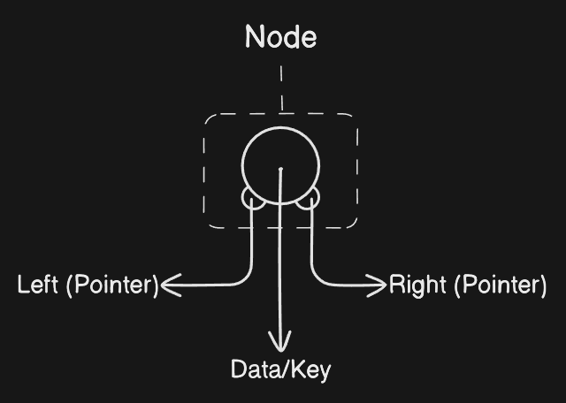
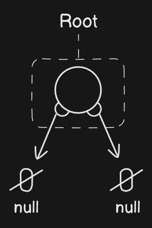

# Core Impletion of Binary Search Tree

&#10687; First &#8227; We need to make a Binary Search Tree Node. This Node is same as Doubly Linked List Node but the pointera act as in tree format.

### Node &#8227;



### Code &#8227;

```javascript
class bstNode {
  constructor(key, left = null, right = null) {
    this.key = key;
    this.left = left;
    this.right = right;
  }
}

// OR

class bstNode {
  constructor(key) {
    this.key = key;
    this.left = null;
    this.right = null;
  }
}
```

### Creating BST Root &#8227;



### Code &#8227;

```javascript
class BinarySearchTree {
  constructor() {
    this.root = null;
  }
}
```
