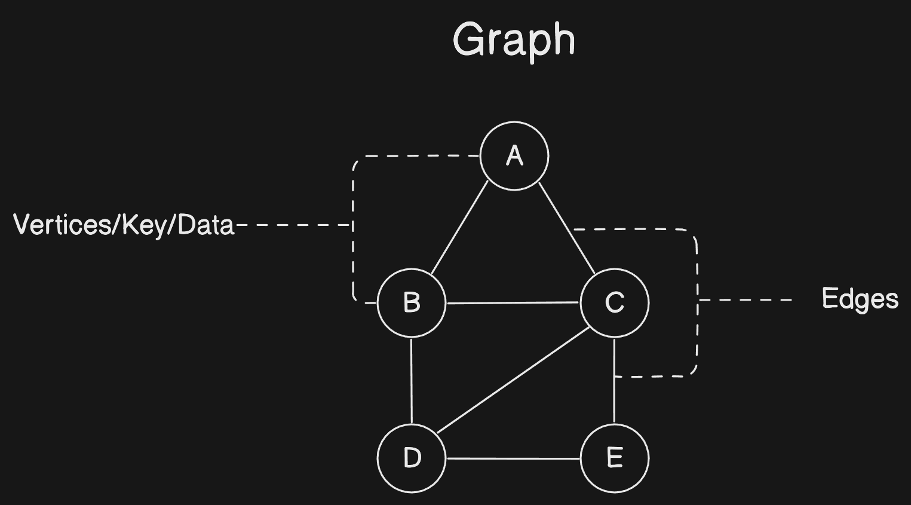

# Graphs Data Structure In Javascript

A graph is a non-linear data structure made up of vertices and edges. Vertices are nodes, while edges are the lines or arcs connecting any two nodes in a graph. In simpler terms, the graph comprises vertices **(V)** and edges **(E)**. The graph is indicated as **G(V, E)**.

Graph data structures are an effective way to represent and analyze complicated relationships between objects or concepts. They can be useful in fields such as social network analysis, recommendation systems, and computer networks.

In sports data science, graph data structures can be utilized to analyze and understand the changing nature of team performance and player interactions on the field.

## Components of a Graph

&#10687; Vertices &#8227; Vertices are the graph's fundamental units. Vertices may also be referred to as nodes or vertex. Each node/vertex can be labeled or unmarked.

&#10687; Edges &#8227; Edges are created or used to connect nodes in a graph. It could be an ordered pair of nodes in a directed graph. Edges can link any two nodes in any way possible. There are no regulations. Edges may also be referred to as arcs. Every edge can be labeled or unlabeled.



## Types of Graphs

&#10687; **Directed Graphs** &#8227; A graph with directional edges, i.e., arrows denoting the direction of traversal. For example, consider a web page graph with directed links between pages.

#### Code &#8227;

```javascript
{
    a: [b, c],
    b: [c, d],
    c: [d, e],
    d: [],
    e: [d]
}
```

#### Visualization &#8227;


&#10687; **Undirected Graphs** &#8227; A graph with no direction, i.e. edges without arrows referring to the direction of traversal. Assume a social network graph in which friendships are not directed.

#### Code &#8227;

```javascript
{
    a: [b, c],
    b: [a, c, d],
    c: [a, b, d, e],
    d: [b, c, e],
    e: [c, d]
}
```

#### Visualization &#8227;


&#10687; **Weighted Graphs** &#8227; A graph in which each edge is assigned a weight or cost. Example: A road network graph with weights representing the distance between two cities.


&#10687; **Unweighted Graphs** &#8227; A graph in which no edges are assigned weights or costs. Consider a social network graph in which the edges show friendships.


&#10687; **Complete Graphs** &#8227; A graph in which each vertex connects to every other vertex. Consider a tournament graph in which each player competes against every other player.


&#10687; **Bipartite Graphs** &#8227; A graph in which the vertices can be separated into separate sets and each edge connects a vertex in one set to a vertex in the other. For example, consider a job applicant network with vertices labeled as job applicants and job openings.


&#10687; **Trees** &#8227; A linked graph without cycles. Consider a family tree in which each member is connected to their parents.

&#10687; **Cycles** &#8227; A graph containing at least one cycle. Consider a bike-sharing graph in which the cycles indicate the routes that the bikes follow.


&#10687; **Sparse Graphs** &#8227; A graph with few edges in comparison to the number of vertices. Consider a chemical reaction graph, in which each vertex represents a chemical compound and each edge indicates a reaction between two compounds.


&#10687; **Dense Graphs** &#8227; A graph that has more edges than vertices. In a social network graph, each vertex represents a person and each edge indicates a friendship.
